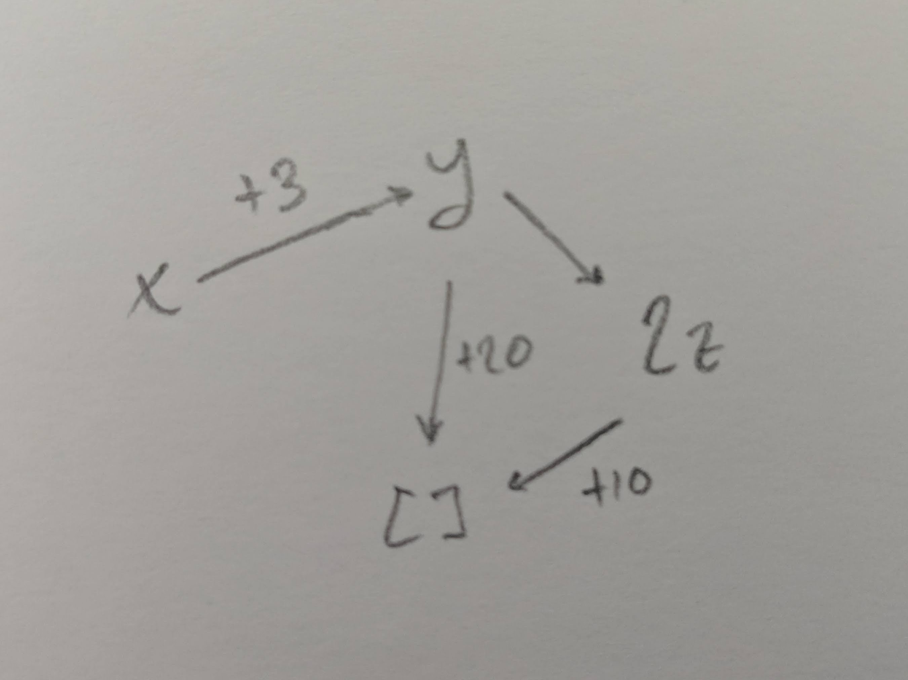
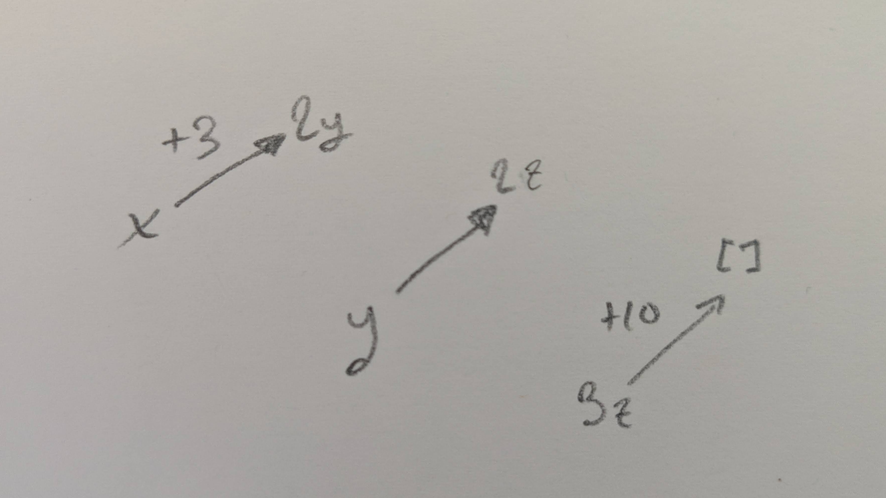
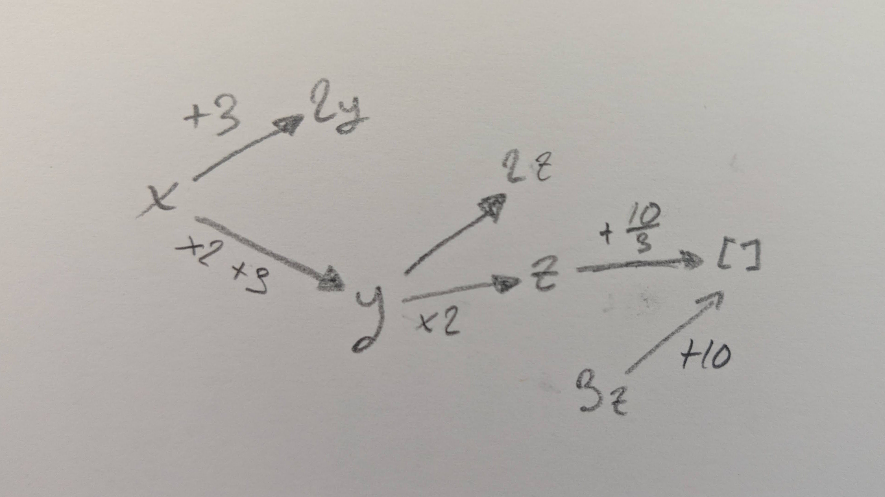

# A description of the graph-based proof method

**Table of Contents**
* [Introduction](#introduction)
* [Input format](#Input-format)
* [Graph construction](#graph-construction)
* [Example 1: Working as intended](#example-1-working-as-intended)
* [Example 2: Adding multipliers](#example-2-adding-multipliers)
  * [Duplicating nodes](#duplicating-nodes)
* [Example 3: Splitting](#example-3-splitting)
  * [Permutations](#permutations)

## Introduction

This document serves as the (somewhat informal) description of the graph-based prover used in this
project. Its overarching method is to use individual sides of linear inequalities as the basis for
nodes in a directed graph where an edge `A -> B` implies `A ≤ B`. Determining the validity of
`A ≤ C` is then approximated by finding the shortest path from `A` to `C`, which is done with the
Bellman-Ford algorithm.

This approach guarantees O(n^2) runtime performance, but (because this is an NP-complete problem) it
is necessarily a conservative approximation. The primary disadvantage of this method is that it
cannot emulate complex substitutions. Where a more complex solver might be able to infer, for
example, from `x ≥ 0`, `y ≥ 0`, and `x + y ≤ 10` that `x*y ≤ 25`, this method cannot without futher
information because there would not be a path *to* the node representing `x*y`.

## Input format

There are two key types of note here: `Inequality` and `Term`, roughly laid out below. These are not
the precise definitions, but they are close enough to convey the meaning.

```rust
struct Inequaltiy {
    lhs:      Vec<Term>,
    rhs:      Vec<Term>,
    constant: int,
}

struct Term {
    vars: Vec<String>,
    coef: int,
}
```

This prover has a single input: `Inequality`s.\* These are used both to represent the initial set
of given statements and each subsetquent statement that is requested to be proven. This inequality
type is simply defined as `lhs ≤ rhs + constant`, which gives a uniform method of handling all
queries.

Each of `lhs` and `rhs` are a sum of `Term`s, where each `Term` is a product of variables with some
non-zero coefficient. For example, one instance of `lhs` could represent `2*x*y + z`, given in the
datatypes as:
```
[Term { vars: ["x", "y"], coef: 2 }, Term { vars: ["z"], coef: 1 }]
```
Exponents are represented as repeated values in `Term.vars`.

It should be noted that throughout this method, terms whose sets of variables differ are not
considered comparable, and so the problem is *effectively* of solving linear inequalities.

---

\* This isn't quite true; the input is actually defined in terms of a more abstract `Expr` type,
   which allows division and parenthesized operators, among other differences. Part of the interface
   provided by this prover involves conversion into the `Inequality` type, which has other
   complications (e.g. denominators may be negative) not covered here.

## Graph construction

Graph construction is fairly simple (though [some improvements](#duplicating-nodes) will be
[discussed later](#permutations)). Each side of an inequality is treated as a single node in the
graph - coefficients and all - and included as such. For any given inequality `in`, an edge is
created from `in.lhs` to `in.rhs`, with weight given by `in.constant`.

This does mean that negative weights are allowed here, so the Bellman-Ford algorithm is used to
calculate shortest paths.

We additionally have the following approximate type definitions for representing the graph:

```rust
struct Node {
    expr:      Vec<Term>,
    less_than: Vec<(Edge, Node)>,
}

type Edge = int;
```

Continuing from above, the inequality `in` would generate the following nodes:

```
LHS := Node { expr: in.lhs, less_than: [(in.constant, RHS)] }
RHS := Node { expr: in.rhs, less_than: [] }
```

These are not exactly the types - in practice, the nodes are represented by their indices in a list,
but that is more of an implementation-specific detail.

## Example 1: Working as intended

In the following sections, we'll be going through a few different modifications made to this method
of proof, but this one will focus on a single example of the system working as intended on the
typcial (simple) case. This will also serve to demonstrate and explain some of the more precise
semantics of the system.

Given the following input requirements:
```
   x ≤ y + 3 ;
   y ≤ 2*z ;
   y ≤ 20 ;
 2*z ≤ 10 .
```
we'll attempt to prove all of the following (one of which cannot be shown):
```
  x ≤ 10; x ≤ 13; x ≤ 15;
  x ≤ 2*z + 1
```

The graph constructed from the requirements has the structure given below.



The node `[]` indicates a constant. Note that `2*z` is its own node (and so would be independent of
a node given only by `z`). This will be discussed further in [Example 2](#example-2-adding-multipliers).

In proving that `x ≤ C` for some constant `C`, we first determine the nodes in the graph between
which we'll measure the distance. In this case, it's `x` and `[]` - the latter of which corresponds
to an "empty" side of the inequality, or simply a constant. For this simple graph, we can see that
the shortest path from `x` to `[]` has a total weight of 13, with +3 coming from `x -> y` and +10
coming from `2*z -> []`.

This step (i.e. executing the Bellman-Ford algorithm) will be the same for any comparison of the
form `x ≤ C`. We then know that the statement is true for C ≤ 13, so we have that `x ≤ 10` and
`x ≤ 13` are both true, while `x ≤ 15` is undetermined - more information would be required.

The general case here is as follows: For any attempt to prove that `α ≤ β + C` for some constant
`C`, we first determine the upper bound on `D` satisfying `α ≤ β + D`. The original statement can
only proven true if `D ≤ C`. The inverse is not necessarily true, however; if `D > C`, we cannot
infer that the statement is false - only that there is not enough information for *this* solver to
determine its validity. An additional check for whether the statement is *false* can be done by
attempting to prove the contrapositive: `β ≤ α + (-C-1)`.

After that brief diversion, we'll finally show that this method does work for other comparisons (not
only those paths from a single variable to a constant). To prove that `x ≤ 2*z + 1`, we find the
value of `C` satisfying `x ≤ 2*z + C` to be 3, as the shortest path from `x` to `2*z` has a length
of 3. We then have that `x ≤ 2*z + 1` because 1 ≤ 3.

## Example 2: Adding multipliers

The improvements discussed here are mainly centered around allowing for the simple cases that a user
might expect to work, with the goal of allowing the system to provide *just enough* functionality
for it to be mostly out of the way of the average user. This can be thought of as a sort of
smoothing of rough edges in the algorithm itself.

As noted in the previous example, when given coefficients on a single variable (e.g. `2*x`), the
node created will include the coefficients. This means that given only `2*x ≤ 10`, this method as it
has been described thus far would be unable to infer that `x ≤ 5`.

The reason for representing nodes **with** the coefficients on terms is because there might be
multiple paths from one node to another, some with differing final multiples of the end node. To put
this concretely, if we were to factor coefficients into the search, we might look for paths from `x`
to `z` and produce all of: `x ≤ z + 1`, `x ≤ 2*z`, and `x ≤ 3*z - 4`. Not only does this make end
comparison more difficult, but it removes the ability to actual perform the Bellman-Ford algorithm;
the lengths of paths might be uncomparable.

One solution would be to iterate through all possible paths from the source node to the destination
node, but this has worst-case exponential time-complexity (interestingly, it is exactly
`O(e^(n/2e))`, which is mirrored in the other proof method).

The solution that has been used here is simply to only factor in the coefficients on variables when
the lengths of paths *can* form a total order. This is only possible when the starting node is the
empty expression (`[]`), so multiplying distances is only multiplying constants. This allows us to
rewrite the previous type definition of `Edge`:

```rust
struct Edge {
    offset: int,
    num:    uint,
    denom:  uint,
}
```
where `num` and `denom` represent the numerator and denominator of the rational multiplier from the
left-hand side to the right. (Note that these are unsigned in order to avoid a similar
time-complexity issue to what was discussed above.)

Now, an edge from nodes `A` to `B` will signify that `A ≤ B\*num/denom + offset`. These can be
generated and inserted into the graph **alongside the existing nodes and edges**. To modify an
example from before, suppose we are given the following inequalities:

```
  x ≤ 2*y + 3
  y ≤ 2*z
3*z ≤ 10
```

Before, the graph would have been completely disjoint:



But now we can fill in additional edges, noting the multipliers given by `num` ("numerator") and
`denom` ("denominator"):



This requires a slight modification to the standard Bellman-Ford algorithm we were using before. To
quote a comment in the source for the inner loop of the algorithm, the part responsible for updating
the distances from the source node to each other.

```
When we calculate an updated distance, there are only two cases where we can
guarantee that everything is comparable:
 1. The multiplier (num / denom) is equal to one; or
 2. The starting node is a constant (i.e. start_node.expr == [])

If neither of these are true, we can't compare, so we must skip that edge.
```

If the multiplier is equal to one, this is exactly the same behavior as what the algorithm had
before. Otherwise - as stated above - the distances are only comparable if the starting node is a
constant.

More specifically, where previously the update rule read:
```rust
let updated = distances[u] + edge.offset;
if updated < distances[v] {
    distances[v] = updated;
}
```
it is now given by:
```rust
let updated = distances[u] * edge.num / edge.denom + edge.offset;
if updated < distances[v] {
    distances[v] = updated;
}
```

#### Duplicating nodes

In order to accomodate the "multipliers" modification, additional nodes and edges are generated from
the original set. This means that we can essentially leave the core of the algorithm unchanged (and
in doing so, keep it simple - and therefore easy to implement and analyze).

The formula for additional added nodes is simple: Given an inequality `α ≤ β + C`, where we can
factor out `d` from the coefficients of the terms in `α` and `n` from the terms in `β`, we rewrite
this as:

```
d*α' ≤ n*β' + C  =>  α' ≤ n*β'/d + C/d
                 =>  α' ≤ β'*n/d + C/d
```
where `α' = α/d` and `β' = β/n`. From this, we add an edge from `α'` to `β'` with an edge given by:
```rust
Edge {
    offset: C/d,
    num: n,
    denom: d
}
```

## Example 3: Splitting

There's one more algorithmic adjustment that we make for this solver, again in the name of getting
out of the way of the user. This one is more simple than the previous. As we've described it so far,
when given `x ≤ 10` and `y ≤ 5`, this solver would not be able to determine that `x + y ≤ 15` -
something that could easily be expected.

To this end, the improvement we're making here does not seek to solve the *general case* of this
problem (that solution would be incredibly expensive), but to allow only the most visible cases to
work as expected. The difference is simple: whenever the normal method of proof fails, we break
apart the inequality into its individual terms, then compare them with a constant value.

For example: If we were asked to prove that `x + y ≤ 15`, we would (after failing through normal
methods) break this into `x` and `y`, independently finding that `x ≤ 10` and `y ≤ 5`. Summing these
gives that `x + y ≤ 15`.

Because independently calculating the shortest paths starting from different terms would be unduly
expensive, we actually run the search in reverse; we compute the distance from a constant to each
*negated* term. So, to prove the example above, we would find (given `0 ≤ -x + 10` and `0 ≤ -y + 5`)
that `0 ≤ -x + -y + 15`, so `x + y ≤ 15`.

#### Permutations

From the above, it's clear that either of two additional steps must be taken to make the "splitting"
method practical: (1) modify the algorithm to search in reverse, or (2) insert negated copies of
nodes.

For the sake of reusing existing infrastructure and minimizing complexity, the second option was
taken. Instead of simply adding negations, however, all permutations for each given requirement are
considered. For example: Given `x + y - z ≤ 4`, we would also generate the following inequalities:

```
x + y     ≤         z + 4
x     - z ≤   - y     + 4
x         ≤   - y + z + 4
    y - z ≤ x         + 4
    y     ≤ x     + z + 4
      - z ≤ x - y     + 4
    0     ≤ x - y + z + 4
```

Note that this will produce `2^n` inequalities, where `n` is the number of terms in the input
inequality. This is something that will typically be acceptable; under what circumstances will the
required inputs for a function have a joint bound on so many different terms?

Given this space complexity (and possible added time complexity to every call to the solver), an
alternate version where only negated values are added is allowed. This method was chosen instead of
that one because it will likely be expected by users. One might reasonably expect that `x + y ≤ 10`
implies `x ≤ 10 - y`.
